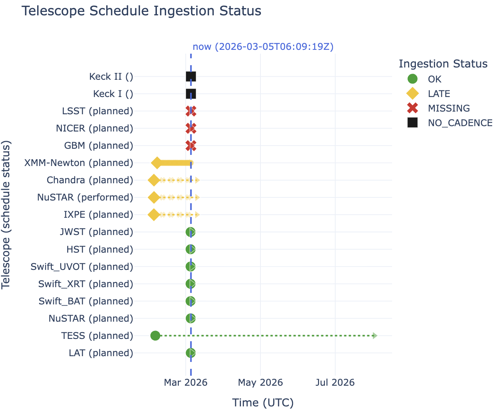
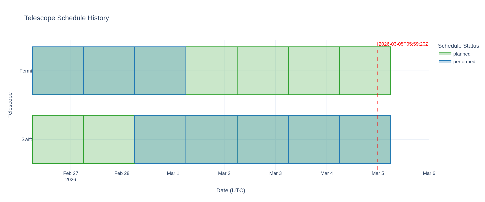

# across-qa
qa scripts for the NASA-ACROSS project

## Quick start

Install in editable mode:

```bash
pip install -e .
```

Run the CLI:

```bash
across-qa
```

## Example

Filter to a telescope name and a schedule status:

```bash
across-qa --telescope swift --status planned
```

Example output:

```text
telescope_name telescope_id schedule_status      cron             last_ingested             next_expected status                                        message
	Swift         t-01       planned 0 * * * * 2026-03-04 10:00:00+00:00 2026-03-04 11:00:00+00:00     OK Schedule is up-to-date. Next expected by 2026-03-04T11:00:00Z.
```

Fail CI when any result is `LATE` or `MISSING`:

```bash
across-qa --exit-code
```

## Python examples

### Date ingestion checker

Use the checker directly in Python to evaluate cadence health for every telescope:

```python
from across.client import Client
from across_qa.checker import check_telescope_ingestion_status

client = Client()
df = check_telescope_ingestion_status(client=client)

# Keep only problematic rows
issues = df[df["status"].isin(["LATE", "MISSING"])]

if issues.empty:
    print("All telescope cadence checks are OK")
else:
    print(issues[["telescope_name", "schedule_status", "status", "message"]].to_string(index=False))
```

#### Visualize ingestion status as an interactive timeline

```python
from across.client import Client
from across_qa.checker import check_telescope_ingestion_status
from across_qa.visualization import plot_ingesetion_status_timeline

client = Client()
df = check_telescope_ingestion_status(client=client)

fig = plot_ingesetion_status_timeline(df)
fig.show()  # opens in browser / Jupyter

# Optionally save to an HTML file
fig = plot_ingesetion_status_timeline(df, output_path="ingestion_status.html")
```

Each telescope / schedule-status combination is plotted as a marker on the time axis, coloured by health:

| Marker | Status | Meaning |
|--------|--------|---------|
| 🟢 circle | **OK** | Schedule ingestion is up-to-date |
| 🟡 diamond | **LATE** | One or more cron runs have been missed |
| 🔴 ✕ | **MISSING** | No schedule has ever been ingested |
| ⬛ square | **NO_CADENCE** | No cron cadence is configured |

A dotted connector line extends from the last ingested time to the next expected ingestion, and small faded markers indicate individual missed cron attempts.



---

### Schedule history

Retrieve and visualize the full schedule history (planned / performed blocks) for one or more telescopes:

```python
from across_qa.history import get_schedule_history, plot_schedule_history

# Fetch last 90 days for all telescopes (default)
df = get_schedule_history()

# Or narrow to specific telescopes and a custom date range
from datetime import datetime, timezone
df = get_schedule_history()

print(df[["telescope_short_name", "status", "date_range_begin", "date_range_end"]])

fig = plot_schedule_history(df)
fig.show()  # opens in browser / Jupyter

# Optionally save to an HTML file
fig = plot_schedule_history(df, output_path="schedule_history.html")
```

Each schedule is rendered as a coloured rectangle spanning its date range:

| Colour | Status |
|--------|--------|
| 🟢 Green | **planned** / **scheduled** |
| 🔵 Blue | **performed** |
| ⬜ Grey | other / unknown |

Overlapping rectangles use a semi-transparent fill so all records remain visible simultaneously. A dashed red vertical line marks today's date.



## Daily Slack ingestion-status notification

A GitHub Actions workflow (`.github/workflows/slack-ingestion-check.yml`)
runs automatically every day at **08:00 MST** and posts the current telescope
schedule ingestion health — along with a PNG timeline — to a Slack channel.

### One-time configuration

Follow these steps once to enable the workflow in your fork / repository:

#### 1. Create a Slack app and bot

1. Go to <https://api.slack.com/apps> and click **Create New App → From scratch**.
2. Give the app a name (e.g. *across-qa-bot*) and select the target workspace.
3. Under **OAuth & Permissions → Scopes → Bot Token Scopes**, add:
   - `chat:write` — post messages
   - `files:write` — upload the PNG attachment
4. Click **Install to Workspace** and copy the **Bot User OAuth Token**
   (starts with `xoxb-`).
5. Invite the bot to the target Slack channel:
   ```
   /invite @across-qa-bot
   ```
6. Note the **Channel ID** (right-click the channel in Slack → *View channel
   details* → copy the ID at the bottom, e.g. `C01234ABCDE`).

#### 2. Add repository secrets

In your GitHub repository go to **Settings → Secrets and variables → Actions**
and add:

| Secret name        | Value                                                  |
|--------------------|--------------------------------------------------------|
| `SLACK_BOT_TOKEN`  | Bot User OAuth Token from step 4 above (`xoxb-…`)     |
| `SLACK_CHANNEL_ID` | Slack channel ID from step 6 above (e.g. `C01234ABCDE`) |

#### 3. Trigger a test run

Navigate to **Actions → Telescope Ingestion Status → Slack** and click
**Run workflow** to verify the bot posts correctly before the first scheduled
run.

---

